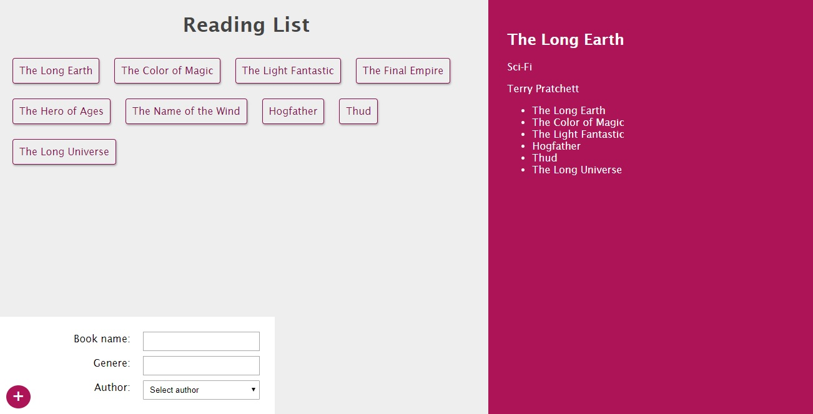

# Your Fav Books Applicaiton
## Full-Stack React-Apollo-GraphQL-Node application: Back-end
... For Front-end, [Click here.](https://github.com/thisis-Shitanshu/graphql-book-collection-client-side)



- How to use:
    - Clone the repo.
    - NOTE: Client and Server will both run on different port.
    1. Client side:
        - Run
            ```
            $ yarn install
            $ yarn start
            ```
    1. Server side:
        - Create a file dev.js
            - export your mlab script from the file as 'mongodb-atlas-string'.
            - Import the file in app.js and connect to mongoose.
        - Run
            ```
            $ npm install
            $ npm install nodemon -g // Optional
            $ nodemon app
                // Conform to see port 4000 is open and conneccted to database.
            ```